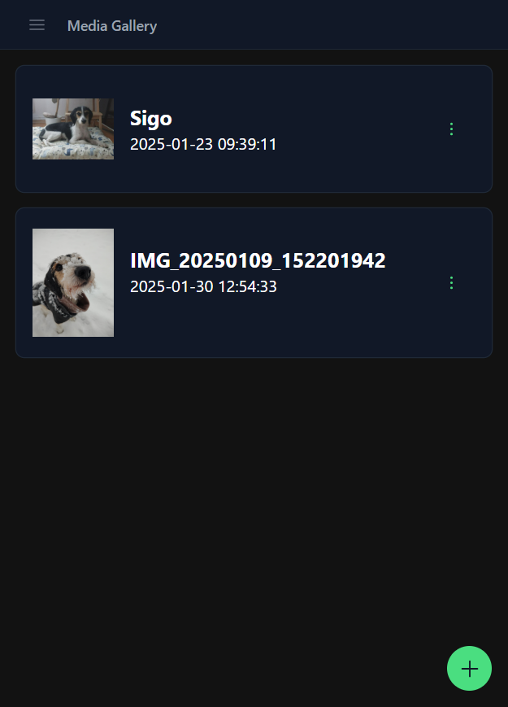

# Nuxt Media Gallery

A simple media gallery built with Nuxt.js and Tailwind CSS for educational purposes.




## Setup

create a `.env` file in the root of the project and add the following environment variables:

```bash
# .env
NUXT_PUBLIC_API_BASE=your_access_key
```

of course you would need an api that provides the endpoints that I used 😅

---

Make sure to install dependencies:

```bash
# npm
npm install

# pnpm
pnpm install

# yarn
yarn install

# bun
bun install
```

## Development Server

Start the development server on `http://localhost:3000`:

```bash
# npm
npm run dev

# pnpm
pnpm dev

# yarn
yarn dev

# bun
bun run dev
```

## Production

Build the application for production:

```bash
# npm
npm run build

# pnpm
pnpm build

# yarn
yarn build

# bun
bun run build
```

Locally preview production build:

```bash
# npm
npm run preview

# pnpm
pnpm preview

# yarn
yarn preview

# bun
bun run preview
```